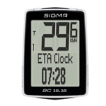

# Communication with BC 16.16 via NFC

Experiments with transmisstion to SIGMA SPORT BC 16.16 (TOPLINE 2016 series) bike computer via NFC

### Before using tools from this repository, please carefully read the disclaimer.

## Disclaimer

**All of materials are for educational and research purposes only.**

The information and tools provided in this repository are not intended for non-legal uses.

The process of reverse engineering device by capturing the data, creating new software and re-applying that data may or may not be illegal in your country. In case of doubts consult your legal councellor

:warning: **It is possible that hacking your bike computer could void warranty.**

:warning: **Author will not assume responsibility for any device problems or failures that occur from using tools provided in this repository. Use on your own risk.**

## Copyrights and trademarks

All bike computer trademarks are the property of **_SIGMA-ELEKTRO_** / **_SIGMA SPORT_**.

All other trademarks, trade names, or logos mentioned or used are the property of their respective owners.

## Requirements

* Delphi 10.2 Tokyo with Mobile Add-On Pack
* NFC-enabled device with Android 6.0+
* BC 16.16 bike computer

## References

Special thanks to [Brian Long](http://blong.com) for great materials about implementing NFC.

Also thanks to authors of (repository with JNI wrappers for the Android SDK)[https://github.com/FMXExpress/android-object-pascal-wrapper]